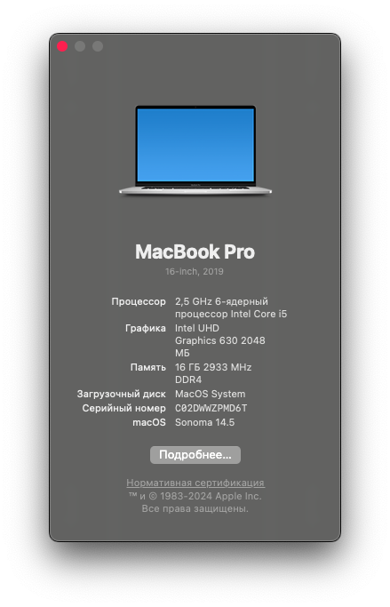

# EFI Mac OS Sonoma для MSI GF75 Thin 10UC-048XRU 17.3" Gaming Laptop, i5-10300H, 16GB, 128GB SSD

MSI GF75 Thin 10UC-048XRU 17.3 OpenCore 1.0 Sonoma 14.5

Руководство: https://dortania.github.io/OpenCore-Install-Guide/

**Конфигурация**

| Конфигурация | Характеристики | 
|--------------------|--------------------|
| Модель компьютера  | MSI GF75 Thin 10UC-048XRU 17.3" (RTX 3050)  | 
| Процессор  | Intel® Core™ i5-10500H @2.50Ghz  |
| Память  | 16 GB DDR4 3200 Mhz (8+8)  |
| Диск  | M.2 PCIe SSD Kingston OM8PCP3512F 512GB  |
| Интегрированная графика  | Intel UHD Graphics 630  |
| Дискретная графика  | NVIDIA GeForce RTX 3050 4GB  |
| Ethernet  | Realtek RTL8168H  |
| Дисплей  | IPS FHD 1920x1080 (17.3 inch) @144Hz  |
| Звуковая карта  | Realtek Audio ALC233  |
| Беспроводная связь  | Intel® Wi-Fi 6 AX201  |
| Ethernet  | Realtek RTL8168H  |

# Изменение настроек BIOS

- Показать скрытые настройки: CTRL Right + SHIFT Right + ALT Left + F2
- Выключить Secure Boot [Security]
- Выключить CFG Lock [Advanced -> Power & Performance -> CPU -> CPU Lock Configuration]
- Отключить Fast Boot [Boot]
- Выбрать режим UEFI без CSM [Boot]

# Работает

- QE/CI графика iGPU Intel® UHD Graphics для 10-го поколения [Intel® UHD 630]
- Управление питанием процессора
- Перезагрузка, сон и выключение
- Аудио Realtek ALC233
- Трекпад с мультитач-жестами
- Состояние батареи
- Bluetooth
- Все USB порты
- Функциональные клавиши
- Кнопки регулировки яркости
- Bluetooth-гарнитура и микрофон
- Wifi
- Видео/аудио через HDMI
- iMessage
- Facetime

# Не работает
- AirDrop
